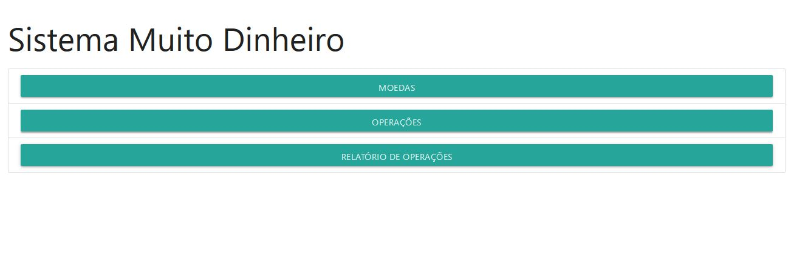

 <h1 align="center">Muito Dinheiro</h1>
 
 ## Compilando e executando o sistema
 Para execução do sistema, é nescessário ter instalado os seguintes itens:
 - [MySql](https://www.mysql.com/downloads/) Versão 08;
   - Banco de dados (schema) com o nome: **muitodinheiro**
   - Usuario: **havan**
   - Senha: **desafiojornadalabs**
   - Ou editar o arquivo `MuitoDinheiro/src/main/resources/application.properties` com os dados do Mysql da máquina local.
    
 - [Java JDK](https://www.oracle.com/java/technologies/javase-jdk16-downloads.html) versão 15 ou superior;
 - [Apache Maven](https://maven.apache.org/download.cgi) com as váriaveis de ambiente [configuradas](https://maven.apache.org/install.html).

### Compilando e executando
```bash
# Clone este repositório
$ git clone <https://github.com/eduardovieira89/muitoDinheiro.git>

# Acesse a pasta do projeto no terminal/cmd
$cd MuitoDinheiro
Onde o arquivo pom.xml se encontra

#Execute os seguintes comandos para o Maven baixar as bibliotecas e gerar o arquivo jar
$mvn clean
$mvn install

#Acesse a pasta template que o maven gerou
$cd template

#Execute o arquivo jar
$java -jar MuitoDinheiro-0.0.1-SNAPSHOT.jar

#O sistema iniciará na porta 8080 - Acesse <http://localhost:8080>

```

## Instruções de utilização
Ao abrir o navegador você terá a página inicial do sistema
<h1 align="center">
  
</h1>

### Moedas

Primeiramente você deve clicar no botão Moedas, e depois no botão adicionar moeda para cadastrá-las no sistema.
<h1 align="center">
  
</h1>

Colocar o nome da moeda (Obrigatório) e o País (opcional) e clicar em salvar.
<h1 align="center">
  
</h1>

Ao salvar, aparecerá a mensagem que a moeda foi salva com sucesso, e limpará os campos para adicionar mais moedas:
<h1 align="center">
  
</h1>

Na lista de moedas, aparecerá todas as moedas cadastradas. No link taxa de câmbio, você irá cadastrar a taxa de câmbio da moeda selecionada
<h1 align="center">
  
</h1>

Aqui é cadastrado a taxa de câmbio, no combobox irá aparecer todas as moedas cadastradas, selecione uma moeda de destino e insira o valor da taxa de câmbio no input field.
<h1 align="center">
  
</h1>

Ao clicar no botão salvar, aparecerá a mensagem que foi cadastrado com sucesso e limpará os campos para inserir novas taxas de câmbio.
<h1 align="center">
  
</h1>

### Operações

Após cadastrar as moedas e suas taxas de câmbio, ja é possível realizar uma operação, para isso volte a página inicial e clique no botão operações.
Para fins de simplicidade, a chave primaria do cliente é seu nome, para um cliente ter várias operações deve-se  incluí-lo exatamente com o mesmo nome.
Ao escolher a moeda de origem no combobox, uma função javascript faz uma requisição para o spring, que popula o combobox de moeda de destino somente com moedas que tem taxa de câmbio cadastradas para a moeda de origem.
Ao selecionar a moeda de destino outra função javascript busca o valor da taxa de câmbio e mostra na tela.
Insira o nome do cliente, moeda de origem, moeda de destino, o valor e clique em processar operação.
<h1 align="center">
  
</h1>
Após processar a operação, uma janela modal é mostrada com os detalhes da operação realizada, mostrando o nome do cliente, data da operação, valor original, valor convertido e a taxa cobrada de 10% do valor convertido.
<h1 align="center">
  
</h1>

### Relatório

Por fim temos os relatórios de operações, onde ao entrar, retorna todas as operações realizadas do dia. É possível fazer pesquisa de várias formas
- Somente por cliente, que irá retornar todas as operações do cliente.
- Cliente e data de inicio. Retornará as operações do cliente selecionado, da data inicial até o dia atual.
- Cliente, data inicial e final, que retornará as operações do cliente no intervalo de datas selecionado.
- Por data de inicio e fim, que retornará todos os clientes no intervalo de datas selecionado.
O resultado da busca retornará o valor total e a taxa cobrada. Retornará também uma tabela com o nome do cliente, data da operação, valor original, valor convertido, taxa da casa, moeda de origem e moeda de destino da operação.
<h1 align="center">
  
</h1>


