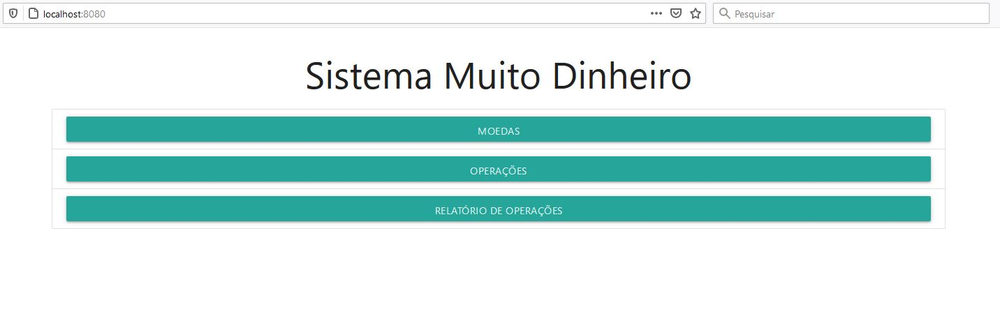

 <h1 align="center">Muito Dinheiro</h1>
 
 ## Compilando e executando o sistema
 Para execução do sistema, é nescessário ter instalado os seguintes itens:
 - [MySql](https://www.mysql.com/downloads/) Versão 08;
   - Banco de dados (schema) com o nome: **muitodinheiro**
   - Usuario: **havan**
   - Senha: **desafiojornadalabs**
   - Ou editar o arquivo `MuitoDinheiro/src/main/resources/application.properties` com os dados do Mysql da máquina local.
    
 - [Java JDK](https://www.oracle.com/java/technologies/javase-jdk16-downloads.html) versão 15 ou superior;
 - [Apache Maven](https://maven.apache.org/download.cgi) com as váriaveis de ambiente [configuradas](https://maven.apache.org/install.html).

### Compilando e executando
```bash
# Clone este repositório
$ git clone <https://github.com/eduardovieira89/muitoDinheiro.git>

# Acesse a pasta do projeto no terminal/cmd
$cd MuitoDinheiro
Onde o arquivo pom.xml se encontra

#Execute os seguintes comandos para o Maven baixar as bibliotecas e gerar o arquivo jar
$mvn clean
$mvn install

#Acesse a pasta template que o maven gerou
$cd template

#Execute o arquivo jar
$java -jar MuitoDinheiro-0.0.1-SNAPSHOT.jar

#O sistema iniciará na porta 8080 - Acesse <http://localhost:8080>

```

## Instruções de utilização
Ao abrir o navegador você terá a página inicial do sistema
<h1 align="center">
  
</h1>

Primeiramente você deve ir em Moedas, e depois no botão adicionar moeda para cadastrá-las no sistema junto com as taxas de câmbio.
<h1 align="center">
  
</h1>

Colocar o nome da moeda (Obrigatório) e o Pais (opcional) e clicar em salvar.
<h1 align="center">
  
</h1>

Ao salvar, aparecerá a mensagem que a moeda foi salva com sucesso, e limpará os campos para adicionar mais moedas:
<h1 align="center">
  
</h1>

Na lista de moedas, aparecerá todas as moedas cadastradas
<h1 align="center">
  
</h1>

<h1 align="center">
  
</h1>
